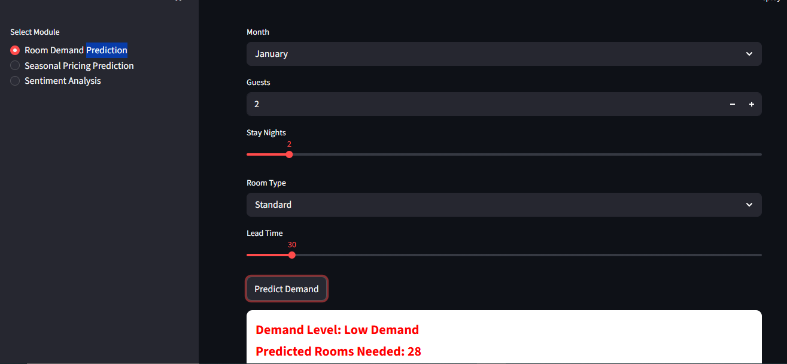
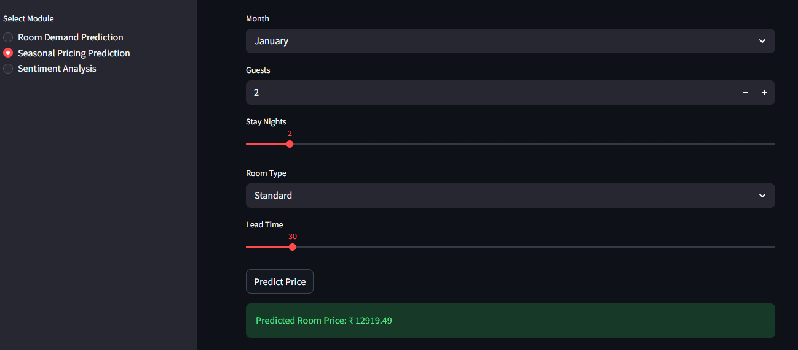
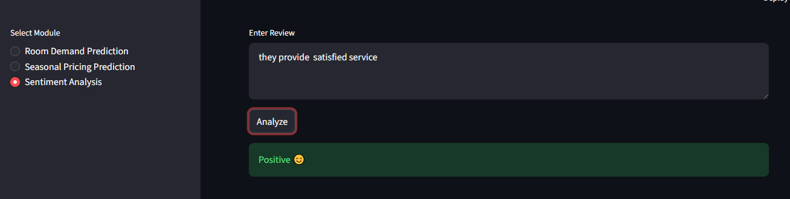

AI-Based Hotel Management System
📌 Project Overview
This project presents an AI-Based Hotel Management System that uses machine learning techniques to improve hotel operations. The system predicts room demand, estimates pricing, and analyzes customer reviews using sentiment analysis through an interactive Streamlit web application.

❗ Problem Statement
Hotels face challenges in predicting room demand, setting optimal pricing, and understanding customer feedback. Traditional methods fail to capture dynamic patterns such as seasonal trends and customer behavior. This project provides an intelligent solution using machine learning.

🎯 Features
📊 Room Demand Prediction

💰 Seasonal Pricing Prediction

💬 Sentiment Analysis

📈 Data Visualization (Graphs & Insights)

🌐 Interactive Web Interface

🧠 Technologies Used
Python

Pandas, NumPy

Scikit-learn

Streamlit

NLP (TF-IDF for sentiment analysis)

📂 Dataset
We used publicly available datasets:

Trip Advisor Hotel Reviews

Hotel Bookings Dataset

⚙️ How to Run the Project
Step 1: Clone the repository
git clone https://github.com/K-Maneesha/ai-based-hotel-management.git
Step 2: Navigate to project folder
cd ai-based-hotel-management
Step 3: Install dependencies
pip install -r requirements.txt
Step 4: Run the application
python -m streamlit run app1.py
📊 Output Screenshots
🔹 Room Demand Prediction

🔹 Seasonal Pricing Prediction

🔹 Sentiment Analysis

📈 Results
Random Forest model provides accurate room demand prediction

Pricing model effectively estimates seasonal room prices

Sentiment analysis correctly classifies customer reviews

System provides real-time insights through an interactive UI

📊 Additional Visualizations
Monthly Demand Graph

Seasonal Pricing Graph

Sentiment Distribution Graph

🔮 Future Improvements
Integration with real-time booking data

Use of advanced models like LSTM

Personalized hotel recommendations

Dynamic pricing automation

👩‍💻 Team Members
Maneesha K

📌 Conclusion
This project demonstrates how machine learning can enhance hotel management by improving demand prediction, pricing strategies, and customer satisfaction analysis. The system is scalable and suitable for real-world applications.

⭐ GitHub Repository
👉 https://github.com/K-Maneesha/ai-based-hotel-management
